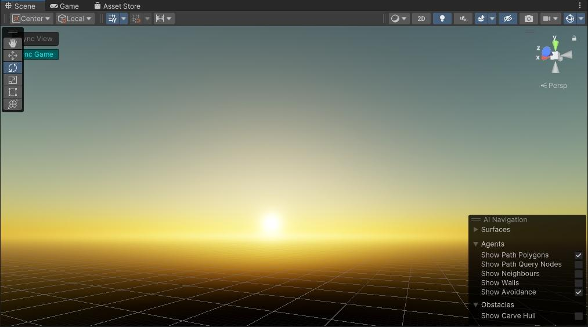
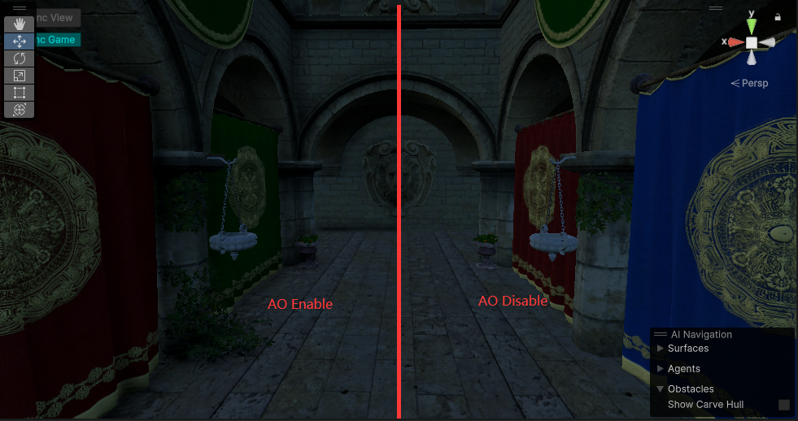
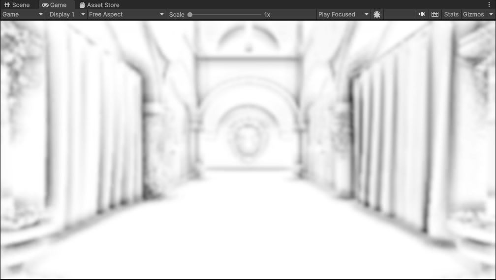

# SRPRendering
This project is a personal rendering pipeline develop various rendering features in unity, based on the scriptable rendering pipeline. 

This pipeline implements the personal exprimental rendering features.

## Features
#### Precompute Atmosphere Scattering

#### Realtime Baking Atmosphere Scattering to Spherical Harmonics
<video src="screenshots/bake_atmophere_sh.mp4" controls></video>
#### Shadow Mapping
<video src="screenshots/shadowmap.mp4" width="1394" height="568" controls></video>
- Percentage-Closer Soft Shadows
- PCSS

- Variance Shadow Mapping

- Exponential Variance Shadow Mapping

- Screen Space Shadow Mapping

#### Camera Relative Rendering

#### Tile based Light Culling

#### SSAO

#### Deferred Shading

