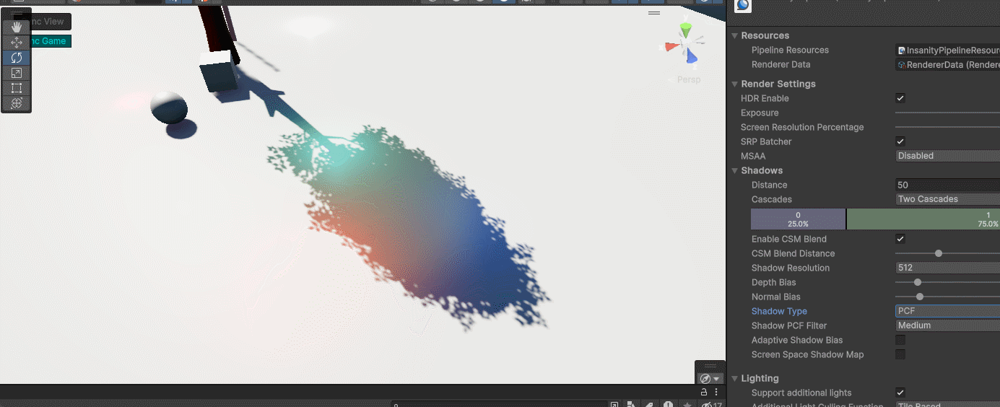

# SRPRendering
This project is a personal rendering pipeline develop various rendering features in unity, based on the scriptable rendering pipeline. 

This pipeline implements the personal exprimental rendering features.

## Features
#### Precompute Atmosphere Scattering

#### Realtime Baking Atmosphere Scattering to Spherical Harmonics

#### Shadow Mapping

- Percentage-Closer Soft Shadows: [Reference page PCSS](pages/PCSS.md)
- Variance Shadow Mapping: [Reference page VSM](pages/VarianceShadowMapping.md)
- Exponential Variance Shadow Mapping: [Reference page EVSM](pages/VarianceShadowMapping.md)
- Screen Space Shadow Mapping

#### Camera Relative Rendering

#### Tile based Light Culling

#### SSAO

#### Deferred Shading

## Screenshots

## Pages
These pages could help you know more about the relative rendering features in this Pipeline.

[Understanding Unity Projection Matrix](pages/understanding_unity_projection_matrix.md)
