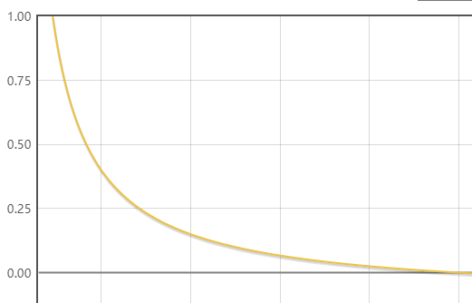
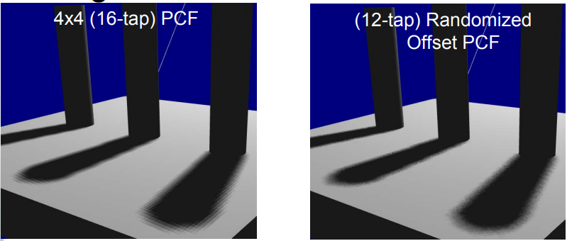
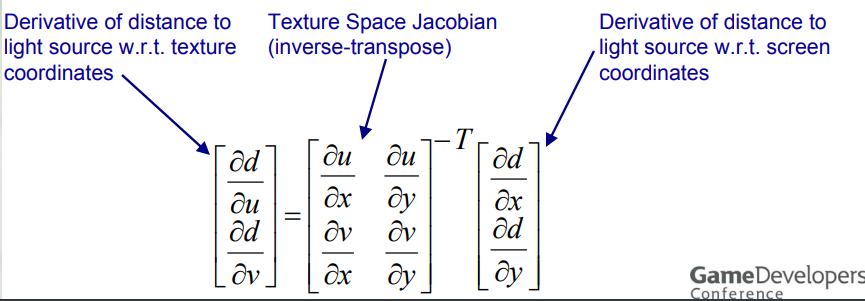

# Percentage Closer Soft Shadows
## Introduction
This paper requires the knowledge of __Percentage Closer Filter(PCF)__. If you know nothing about it, please read the reference materials about __PCF__ first. The algorithm of __PCSS__ is based on PCF.
## Algorithm
When a pixel is shading, we need to transform the coordinate of this pixel to the shadowmap space, then sample the depth value from the shadowmap. 
The soft shadow of PCSS is based on the kernel size of PCF, which means that the larger the kernel size, the softer it will appear. Therefore, the core algorithm is to dynamically change the kernel size.
This algorithm mainly consists of three steps.
### Step 1
__Blocker search__. We could consider a blocker as a fixed size region around the shading pixel in shadowmap space. A blocker could decide how large the kernel size is. The kernel size depends on the avarage depth of the blocker. So in this step, we will calculate the avarage depth of the shadowmap based on the blocker size, which means that we could get "the depths that are closer to the light source" mentioned in paper[1]. The blocker size depends on the light size and the world position of the shading point to the light source.
>**Notes**: If the light is a directional light, the light size is fixed. We could use a variable softness to simulate the light size.

### Step 2
__Penumbra estimation__. Use the following fomula mentioned in paper[1].

$w_{Penumbra} = (d_{Receiver} - d_{Blocker}) \cdot w_{light}/d_{Blocker}$

This foluma calculates the size of the penumbra, we could use this size to represent the kernel size of PCF.

$d_{Blocker}$ is the avarage depth of the blocker which could be get in Step 1. 
$d_{Receiver}$ is the distance of the pixel from the light source. 
If we consider $w_{Light}$ as a fixed value. We could consider the formula as a 1D function with argument $d_{Blocker}$.

See the function graph below:



We could see the larger the $d_{Blocker}$, the smaller the penumbra size.


### Step 3
This step is filter the shadow compare value by the using the kernel size which is calculated in Step 2.
For performace, kernel size should not equal the samples count. We just fix the samples count and decide the radius of the kernel by the penumbra size.

## Detals
### Poisson Disk Sampling
Canonical PCF sampling in a 4 x 4 grid pattern
Poisson disk samples are closer to each other with the minimum distance.
We can randomly rotate the Poisson disk samples around its center to make an improvement.
Because we want to rotate the Poisson disk randomly, we should introduce random numbers which are camera stable for reducing flickering.
So how to generate these random numbers? We can use a noise texture which was pregenerated.
This is the result of Uniform Grid Offset Sampling compared with non-uniform Disk Offset Sampling:



If we rotate the disk samples we can get the TV noise pattern:


### Depth Bias
#### Receiver Plane Depth Bias
This implementation is from [Isidoro-ShadowMapping](https://developer.amd.com/wordpress/media/2012/10/Isidoro-ShadowMapping.pdf).
How to understand the derivative below?



I use mathematics tools to explain.
About the Jacobian Det, we have:

$f(u, v) = f(u(x,y), v(x, y))$

```math
\begin{aligned}
J(u,v) = \begin{bmatrix} \frac{\partial u}{\partial x} & \frac{\partial u}{\partial y} \\ \frac{\partial v}{\partial x} & \frac{\partial v}{\partial y} \end{bmatrix}
\end{aligned}
```

In screen space, we can just know the depth derivative of screen coordinate x and y.
But we still don't know the depth derivative in shadowmap space of coordinate u and v.
And if we see d as a depth function of the shadowmap, we have:
d(u, v) = d(u(x,y), v(x, y)) so d is the composite function
Now we want to know the derivative of d to (x,y). It is a second derivative because u and v are the functions of x and y.
So we use the chain rule of composite function derivative:
```math
\frac{\partial d}{\partial x} = \frac{\partial d}{\partial u} \frac{\partial u}{\partial x} + \frac{\partial d}{\partial v} \frac{\partial v}{\partial x}
```
```math
\frac{\partial d}{\partial y} = \frac{\partial d}{\partial u} \frac{\partial u}{\partial y} + \frac{\partial d}{\partial v} \frac{\partial v}{\partial y}
```
So it can be seen as matrix multiplication.

```math
\begin{bmatrix}
\frac{\partial d}{\partial x} \\
\frac{\partial d}{\partial y}
\end{bmatrix} 
= \begin{bmatrix}
\frac{\partial u}{\partial x} & \frac{\partial v}{\partial x}\\ 
\frac{\partial u}{\partial y} & \frac{\partial v}{\partial y}
\end{bmatrix}
\begin{bmatrix}
\frac{\partial d}{\partial u}\\ 
\frac{\partial d}{\partial v}
\end{bmatrix}
```
Then we can see the matrix as the transpose of the Jacobian matrix.
So we get the formula above.
After we get the derivative of depth value, how should we use it?
The derivative of the depth in shadow space can not be used as the depth bias directly.
The depth bias is calculated by multiplying the shadowmap texel size, which is also the uv offset in uv space.
> float2 receiverPlaneDepthBias = GetReceiverPlaneDepthBias(shadowCoord.xyz);
float __fractionalSamplingError__ = 2.0 * dot(ShadowMapTexelSize.xy, abs(receiverPlaneDepthBias));
We use the __fractionalSamplingError__ as the bias.
But I still don't understand why it multiply the texelsize. 

## Reference
Randima Fernando Percentage-Closer Soft Shadows.[1]
