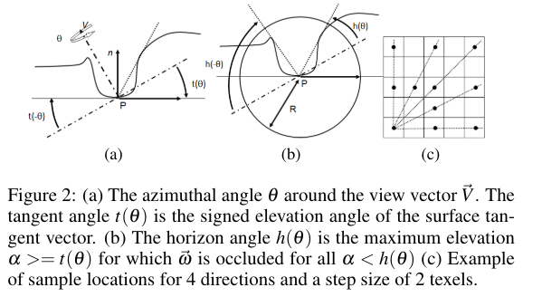
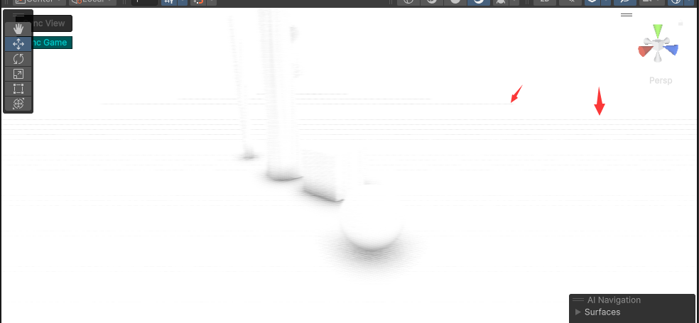
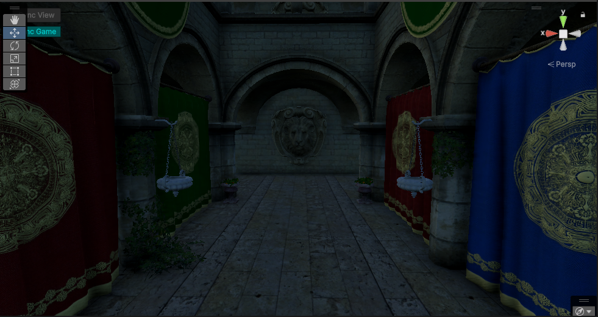
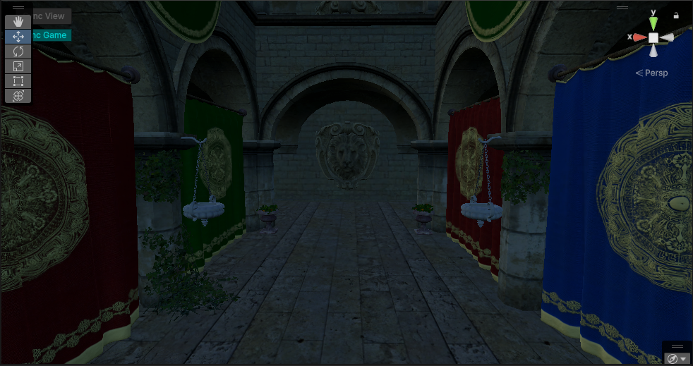

# Screen Space Ambient Occlusion
## Introduction
Ambient occlusion is a lighting model that approximates the amount of light reaching a point on a diffuse surface based on its directly visible occluders. I am going to introduce the theory of screen space ambient occlusion(SSAO) and explain the details about the classic algorithm of SSAO like HBAO. Of course there are several methods such as HBAO(Horizon-Based Ambient Occlusion), GTAO(Ground-Truth Ambient Occlusion), Alchemy AO, etc. 
## HBAO(Horizon-Based Ambient Occlusion)
This section will introduce the algorithm of HBAO. We focus on the details of the algorithm.
### Theory
The form of the ambient occlusion illumination $A$ at a given surface point $P$:

$`A = 1 - \frac{1}{2\pi}\int _{\varOmega }V(\overrightarrow{\omega})W(\overrightarrow{\omega})\rm d\omega`$

Where $V(\overrightarrow{\omega})$ is the visibility function of direction $\omega$, $W(\overrightarrow{\omega})$ is the linear attenuation function.
Paper Image-Space Horizon-Based Ambient Occlusion by Louis Bavoil define the AO equation as follow:

$`A= 1-\frac{1}{2\pi}\int_{\theta=-\pi}^{\pi}\int_{\alpha=t(\theta)}^{h(\theta)}W(\overrightarrow{\omega})\cos(\alpha)d\alpha d\theta`$        (2)

In order to make us understand clearly, I would like to define the minus part as the occlusion part, means the level of occlusion.
So the equation can be written as:

$`A = 1 - O(p)`$

And we can say the larger the O(p), the darker the p.
What determines the level of occlusion?
First we have to understand equation (2) from the paper.



We know that $\alpha$ is between $t(\theta)$ and $h(\theta)$, image if $\alpha$ is larger means it closer to the depth field, so the O(p) will be larger. $\sin(\alpha)$ is proportional to  $\alpha$ .

$` \int _{t(\theta)}^{h(\theta)}\cos(\alpha)\rm d\alpha = \sin(h(\theta)) - \sin(t(\theta)) `$    (3)

This yields the final equation:

$` A = 1 - \frac{1}{2\pi} \int_{\theta = -\pi}^{\pi}(\sin(h(\theta))-sin(t(\theta)))W(\theta)d\theta`$

Here $W(\theta)$ is the linear attenuation function, where
$W(\theta) = max(0, 1 - r(\theta)/R)$
If the distance between $p$ and $r(\theta)$ is greater than $R$, means the linear attenuation of the sample point take no effect to $p$.

### Integration
For every pixel, we compute its eye-space position P and we integrate Equation (3) using a Monte Carlo approach by sampling directions in image space and stepping on the heightfield stored in the depth image.
I summarize the integration into the following steps.
First, project the sphere to a disk to the uv space. The radius of the sphere is R.
Second, sampling direction in the projected disk. Then rotate the directions by random angle and jitter the sample by random offset.
Third, compute the AO for each sample. In this process, we have to transform the sample point
Paper [2] tells more about the details.

### Random Sampling
As mentioned in the previous section, we have to sample the direction in the projected disk. It consider as per pixel random direction. How can we sample a random direction? There is an effective method called Interleaved Gradient Noise(IGN) instead of blue noise texture sampling. [5] introduces interleaved gradient noise for TAA sampling. The official SSAO in Unity uses IGN to sample random directions as well. 

>Note: Sample points will cause self-occlusion in some cases. If the sample point is in the same pixel with the center point, it will cause self-occlusion after you transform the sample point to the view space.

That's because the screen space floating value is not the same as the current pixel screen space coordinate. One pixel can only represent one coordinate, but one pixel contains a large number of floating points. 



Look at this dark lines, it is caused by same pixel sample points.

### Flickering problem
Flickering is obvious if we use half resolution of the AO Mask.


My solution is to use the temporal filtering approach mentioned in paper [8]. We use a histroy buffer to store the AO and depth of the previous frame, and dispatch a compute shader to temporal filter the ao mask. Here I address the ghosting issue by using the method mentioned in [9].
After temporal filter: 


It looks better than before, but the flickering issue still exists on the high frequency surfaces. I will try to use __MSAA__ to fix it in the future.

### Radius Conversion
How can we define the radius? Deal to the fact that when we sample the random point in shader we have to convert the radius into uv space. But the radius varies in different pixels of the depth buffer. So we have find a way to convert the radius into correct uv space value. Suppose we define the radius in the unit of pixel of the far plane, then we can calculate the real radius of each pixel according to the depth buffer.


How to convert projected depth to view space linear depth?
Look at the perspective matrix:


$`
P_n = M_{persp} \times P = \left[ \begin{matrix}
n \times p.x \\
n \times p.y \\
? \\
z
\end{matrix} \right]
`$

$P_{NDC}$ is the homogeneous coordinates of $P_n$
So the world space radius transforms into the NDC space is:
$R_{ndc} = (M_{persp}.11 \times R_{world} / P.z, M_{persp}.22 \times R_{world} / P.z)$
This is the code to calculate the actual sample point by radius in NDC:
```c++
float radiusSS = min(RADIUSINWORLD * rcp(screenPosVS.z), MAX_RADIUS_IN_NDC);
float2 scalingFactorSS = _ProjectionParams * radiusSS;  //remap the radius to ndc space

float2 samplePointVec = mul(rotation, SPIRAL_KERNEL[i]) * scalingFactorSS;
```

## Result


Turn on AO:


Turn off AO:


## Performance
I test the performance under RTX3060 by NSight Graphics.

Half resolution:


Full resolution:


## Reference
[Louis Bavoil. Image-Space Horizon-Based Ambient Occlusion](https://artis.inrialpes.fr/Membres/Olivier.Hoel/ssao/nVidiaHSAO/2317-abstract.pdf) [1]

[Louis Bavoil. Image-Space Horizon-Based Ambient Occlusion PPT](https://developer.download.nvidia.com/presentations/2008/SIGGRAPH/HBAO_SIG08b.pdf) [2]

https://graphics.tudelft.nl/Publications-new/2012/KRES12/paper.pdf [3]

[The Alchemy Screen-Space Ambient Obscurance Algorithm](https://casual-effects.com/research/McGuire2011AlchemyAO/VV11AlchemyAO.pdf) [4]

[Interleaved Gradient Noise: A Different Kind of Low Discrepancy Sequence](https://blog.demofox.org/2022/01/01/interleaved-gradient-noise-a-different-kind-of-low-discrepancy-sequence/) [5]

[Daniel Kvarfordt & Benjamin Lillandt. Screen Space Ambient Occlusion](https://www.cse.chalmers.se/edu/year/2018/course/TDA361/Advanced%20Computer%20Graphics/SSAO.pdf) [6]

[Evaluating Tessellation and Screen-Space Ambient Occlusion in WebGL-Based Real-Time Application](https://core.ac.uk/download/pdf/97833395.pdf) [7]

[Stable SSAO in Battlefield 3 with Selective Temporal Filtering](https://d29g4g2dyqv443.cloudfront.net/sites/default/files/akamai/gamedev/files/gdc12/GDC12_Bavoil_Stable_SSAO_In_BF3_With_STF.pdf) [8]

[Generating smooth and cheap SSAO using Temporal Blur](https://www.gamedeveloper.com/programming/generating-smooth-and-cheap-ssao-using-temporal-blur) [9]