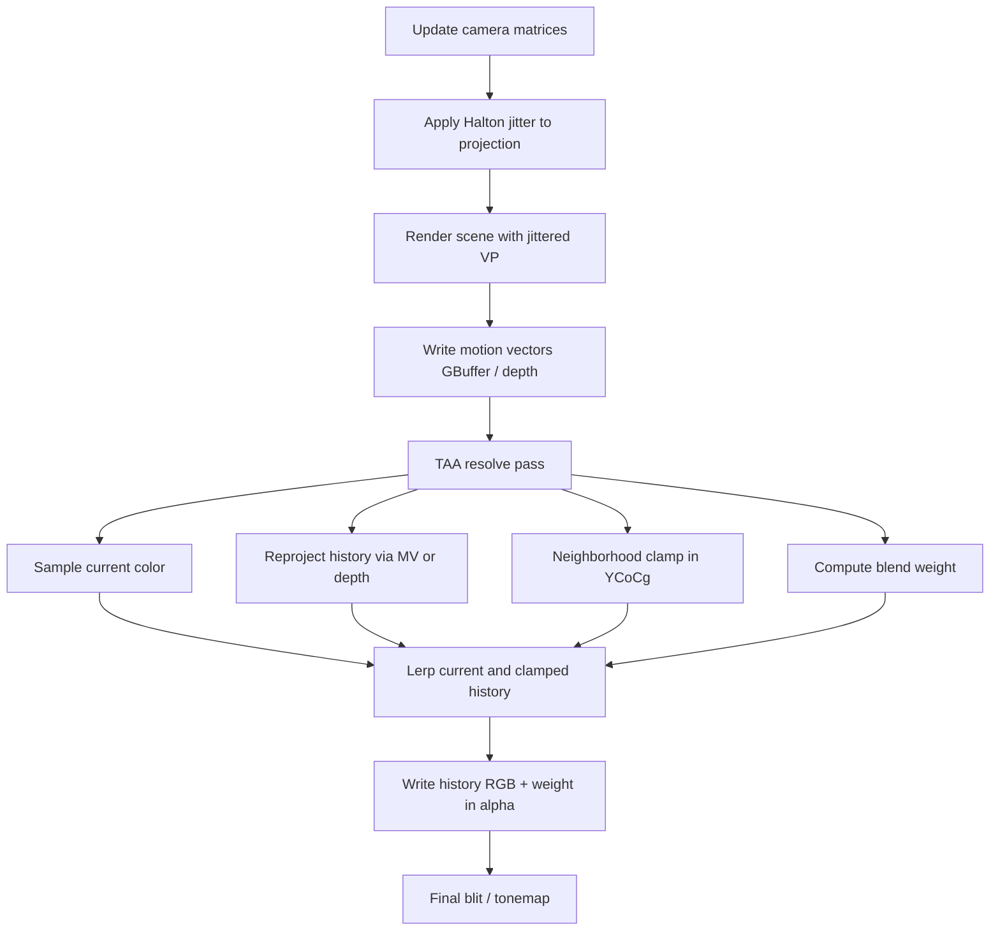

# Temporal Anti-Aliasing

## 1. TAA Overview

Modern real-time rendering almost always runs at a fixed resolution, usually one sample per pixel. Geometry edges, specular highlights, thin features (wires, foliage, distant railings), and shaded high-frequency detail therefore alias: they shimmer, crawl, or flash as the camera or objects move.

**Temporal Anti-Aliasing (TAA)** fights that aliasing by treating time as an extra sampling dimension. Instead of paying for many spatial samples in one frame (MSAA, SSAA), TAA:

1. **Jitters** the camera projection each frame by a sub-pixel offset (typically a low-discrepancy Halton sequence).
2. Renders a cheap single-sample image under that jitter.
3. **Reprojects** the previous frame’s accumulated result into the current view.
4. **Blends** current and history samples, with safeguards so that wrong history does not ghost.

Over a short window of frames, each pixel accumulates several slightly different sample positions. The result approximates a higher effective sample count, while remaining affordable on consoles and mid-range GPUs.

In games, TAA usually sits at the end of the opaque lighting pipeline (after deferred/forward shading, SSAO, shadows, etc.) and before tone mapping / UI. It is the dominant AA method in many engines because it:

- Softens staircase edges without MSAA’s GBuffer cost in deferred pipelines.
- Stabilizes shimmering specular and thin geometry that pure spatial filters miss.
- Doubles as a light temporal filter for noisy effects (when carefully tuned).

The trade-off is well known: ghosting, blur under motion, and **flicker** when history is rejected too often. The rest of this article describes a practical TAA stack and how those failure modes are handled.

---

## 2. TAA Implementation

### 2.1 Process Overview

At a high level, one frame of TAA looks like this:

#### Required data

| Resource / data | Role |
|-----------------|------|
| **Current color** | This frame’s lit HDR/LDR image (jittered). |
| **History color (ping-pong RT)** | Previous resolve output; RGB = color, **A = accumulated weight**. |
| **Depth** | Closest-depth neighborhood search; optional depth-based reprojection. |
| **Motion vectors** | UV-space offset from current pixel to previous frame (preferred). |
| **Jittered view-projection** | Used for rasterization so sub-pixel samples move each frame. |
| **Non-jittered view-projection (current & previous)** | Used to compute “true” motion without baking jitter into velocity. |
| **Previous camera position** | Required under camera-relative rendering when evaluating previous VP. |
| **Texel size / resolution** | Converts UV motion to pixels for motion-length weighting. |

History is stored in a **two-buffer ping-pong**: frame $`N`$ reads history $`A`$ and writes history $`B`$; frame $`N+1`$ swaps. The first frame after enabling TAA copies the current color and seeds the weight channel.

---

### 2.2 Motion Vectors and Jitter

#### Jitter UV / projection jitter

Sub-pixel offsets come from a Halton sequence in bases 2 and 3, shifted into $`[-0.5,\,0.5]`$ **pixel** units:

$`j_x = H_2(i) - 0.5,\quad j_y = H_3(i) - 0.5`$

Applied to the camera projection **before** building the GPU projection matrix:

$`P_{02} \mathrel{+}= \frac{2 j_x}{W},\quad P_{12} \mathrel{+}= \frac{2 j_y}{H}`$

The same offset expressed in UV space is:

$`\mathbf{j}_{\mathrm{uv}} = \left(\frac{j_x}{W},\,\frac{j_y}{H}\right)`$

**Role of the jittered projection:** it is what the GPU uses to rasterize the frame. Without it, temporal accumulation only averages the same sample position and does not supersample edges.

**Role of the non-jittered projection:** motion vectors and depth reprojection must measure *camera/object* motion only. If velocity includes the Halton delta, a static scene reports non-zero motion every frame, history is constantly mis-reprojected, and TAA fails (visible shake).

#### Motion vector calculation

For a world (or camera-relative) position $`\mathbf{p}`$:

$`\mathbf{u}_{\mathrm{curr}} = \mathrm{UV}\!\left(P_{\mathrm{nj}}\,V_{\mathrm{nj}}\,\mathbf{p}\right)`$

$`\mathbf{u}_{\mathrm{prev}} = \mathrm{UV}\!\left(P_{\mathrm{nj}}^{\mathrm{prev}}\,V_{\mathrm{nj}}^{\mathrm{prev}}\,\mathbf{p}'\right)`$

$`\mathbf{v} = \mathbf{u}_{\mathrm{curr}} - \mathbf{u}_{\mathrm{prev}}`$

where $`\mathrm{UV}`$ maps NDC to $`[0,1]^2`$, and $`\mathbf{p}'`$ accounts for camera-relative space:

$`\mathbf{p}' = \mathbf{p} + \left(\mathbf{c}_{\mathrm{curr}} - \mathbf{c}_{\mathrm{prev}}\right)`$

History lookup is then:

$`\mathbf{u}_{\mathrm{hist}} = \mathbf{u} - \mathbf{v}`$

**Role of motion vectors:** they answer “where was this surface last frame?” so history can be fetched under camera and object motion. Without them (or with wrong ones), TAA either ghosts or falls back to trusting only the current frame—and aliasing returns.

If GBuffer motion vectors are unavailable, a depth-based fallback unprojects with the non-jittered inverse VP, applies the same camera-relative offset, and reprojects with the previous non-jittered VP.

#### Neighborhood velocity (closest depth)

At depth discontinuities, a pixel’s own velocity may belong to the background while the silhouette belongs to the foreground. A common fix is to search a $`3\times3`$ neighborhood, take the **closest** depth sample, and use that pixel’s motion vector (**z-min dilation**). Thin foreground features then reproject more reliably.

---

### 2.3 Core Algorithm and Why It Anti-Aliases

#### Karis-style temporal supersampling (intuition)

Brian Karis’ *High Quality Temporal Supersampling* frames TAA as accumulating samples of a continuous signal $`f`$ over time. With jitter, frame $`t`$ samples at offset $`\mathbf{j}_t`$. After reprojection, the estimate at a stable pixel is a weighted combination of past samples.

A simple exponential moving average is:

$`\mathbf{c}_t = w\,\mathbf{c}^{\mathrm{curr}}_t + (1-w)\,\mathbf{c}^{\mathrm{hist}}_t`$

with $`0 < w \le 1`$. Small $`w`$ means strong history (smoother, more ghosting risk); large $`w`$ means responsive but more temporal noise / aliasing.

Because history may sample a different surface after occlusion or velocity error, Karis and later work **clamp** history to the current frame’s local neighborhood before blending. Clamping in **YCoCg** (rather than RGB) better preserves luminance structure and reduces color flicker.

#### Resolve steps used here

1. **Reproject** history UV via dilated motion vectors (or depth).
2. **Sample history** with **Catmull–Rom bicubic** (five bilinear taps; MJP / production TAA practice) for sharper temporal reconstruction than a single bilinear fetch.
3. **Neighborhood bounds:** 5-tap cross (center + 4-neighbors) in YCoCg → $`\mathbf{b}_{\min},\,\mathbf{b}_{\max}`$.
4. **Clamp:** $`\mathbf{c}^{\mathrm{hist}} \leftarrow \mathrm{YCoCg}^{-1}\!\big(\mathrm{clamp}(\mathrm{YCoCg}(\mathbf{c}^{\mathrm{hist}}),\,\mathbf{b}_{\min},\,\mathbf{b}_{\max})\big)`$.
5. **Blend weight** from history alpha, raised toward $`1`$ under fast motion / depth divergence, floored by a minimum current-frame weight $`w_{\max}`$:

$`L = \|\mathbf{v}\odot(W,H)\|`$

$`m = \left(\mathrm{saturate}\!\left(L / L_{\max}\right)\right)^{\gamma}`$

$`d = \mathrm{saturate}\!\left(10\cdot\frac{z_{\max}-z_{\min}}{z_{\max}}\right)`$

$`w \leftarrow \max\!\big(w,\; m,\; w_{\max}\big)\quad\text{(after motion–depth lerp)}`$

6. **Update stored weight** (exponential sample count style):

$`w_{\mathrm{out}} = \frac{1}{1/w + 1}`$

7. Optionally blend in an approximate **linear** domain for LDR (`sRGB ≈ x²` / `√x`) so the temporal filter is less biased in perceptual space.

#### Why this reduces aliasing

- Jitter changes which edge fragments land in a pixel each frame.
- History reintroduces samples from nearby sub-pixel locations after alignment.
- Clamping keeps only history consistent with the current neighborhood, approximating Karis’ neighborhood constraint.
- Motion / depth adaptive weights discard history when alignment is untrustworthy, trading AA for responsiveness.

The long-run effect is closer to integrating the pixel footprint over multiple sample positions—temporal supersampling—without rendering those samples in a single pass.

---

## 3. Flickering Issues and Mitigations

Flicker in TAA usually means **history is rejected or misaligned every frame**, so the image snaps between single-sample shaded results. Below are concrete failure modes and the algorithms that address them.

### 3.1 Jitter baked into motion vectors (static camera shake)

**Symptom:** Even with a locked camera, the image jitters; TAA seems to amplify shake.

**Cause:** Velocity used the jittered current clip position minus a previous jittered VP. The Halton delta appeared as motion, so history was always sampled from the wrong UV.

**Fix:** Compute motion with **non-jittered** current and previous view-projection matrices. Rasterization still uses the jittered matrix; velocity must not.

### 3.2 Jitter applied after `GetGPUProjectionMatrix`

**Symptom:** Large, incorrect camera shake under TAA, especially on D3D (Y-flip).

**Cause:** Modifying $`P_{02}/P_{12}`$ on an already platform-adjusted GPU projection breaks offset direction/magnitude.

**Fix:** Apply Halton offsets on the **camera** projection, then call the platform GPU projection helper.

### 3.3 Sky / effects using jittered inverse VP

**Symptom:** Background or sky shimmer that TAA cannot fully hide.

**Cause:** Fullscreen sky reconstruction used the jittered inverse view-projection for view rays.

**Fix:** Reconstruct sky / environment directions with **non-jittered** inverse VP so the background is temporally stable while the main camera still jitters for AA.

### 3.4 Neighborhood clamp too aggressive (thin features flash)

**Symptom:** Specular dots, wires, and distant thin geometry flicker on and off.

**Cause:** Tight RGB min/max boxes discard valid bright history when coverage changes under jitter.

**Mitigations tried / used:**

- Clamp in **YCoCg** with a **5-tap cross** (less severe than a full $`3\times3`$ RGB box).
- Prefer **Catmull–Rom** history sampling for better reconstruction under sub-pixel motion.
- Avoid over-reliance on hard color/normal rejects that dump history every frame.

### 3.5 Missing velocity dilation at silhouettes

**Symptom:** Edges crawl or flicker under slight motion.

**Cause:** Background velocity at the silhouette pixel; history samples the wrong layer.

**Fix:** **Closest-depth (z-min) neighborhood** for motion vector selection before reprojection.

### 3.6 Depth discontinuities / disocclusion

**Symptom:** Ghosting behind moving objects, or flicker when ghosts are clamped away.

**Fix:** Measure neighborhood depth spread (**divergent depth**) and raise the current-frame blend weight so disoccluded regions trust the new frame.

### 3.7 Fast motion without weight adaptation

**Symptom:** Heavy blur or swimming trails when the camera pans quickly; or blocky aliasing if history is kept blindly.

**Fix:** **Motion length factor** in pixel units: as $`\|\mathbf{v}\|`$ grows, increase current-frame weight (and optionally shut down temporal AA when motion exceeds a threshold), similar to production TAA (e.g. motion-length curves used in large game titles).

### 3.8 Camera-relative rendering breaking previous-frame positions

**Symptom:** Static camera looks fine; **moving camera** shows strong aliasing / misaligned history.

**Cause:** Positions are stored relative to the *current* camera, but the previous VP expects positions relative to the *previous* camera. Using $`\mathbf{p}`$ unchanged with $`VP_{\mathrm{prev}}`$ yields wrong $`\mathbf{u}_{\mathrm{prev}}`$.

**Fix:**

$`\mathbf{p}' = \mathbf{p} + (\mathbf{c}_{\mathrm{curr}} - \mathbf{c}_{\mathrm{prev}})`$

before multiplying by the previous non-jittered VP (same offset for depth-based reprojection).

### 3.9 Note on NDC vs UV velocity scale

Some engines encode velocity as an NDC delta and multiply by $`1/2`$ when converting to UV (as in HDRP-style `EncodeMotionVector(motion * 0.5)`). If UV-space velocity is written directly via $`\mathbf{u}_{\mathrm{curr}}-\mathbf{u}_{\mathrm{prev}}`$, that extra $`1/2`$ must **not** be applied again. Confusing the two conventions under- or over-scales reprojection and looks like “broken motion vector scaling.”

### 3.10 Post-effect / debug views of pre-TAA buffers

**Symptom:** Depth, normals, or SSAO debug views flicker whenever TAA is on, while the final color blit looks stable.

**Cause:** The final blit shows the **TAA-resolved** color. Debug views often sample **raw jittered** GBuffer/depth/SSAO. The blit shader is not magically immune—its *input* already went through temporal resolve.

**Mitigation (engine policy):** skip camera jitter while a raw-buffer debug mode is active, or accept that pre-TAA buffers will show sub-pixel motion.

### 3.11 Screen-space effects under jitter (e.g. SSAO)

**Symptom:** SSAO (or similar) flickers with TAA even if the main TAA pass is correct.

**Cause:** Depth/normals are jittered, but AO was unprojected with mismatched matrices, or temporal AO rejection was too harsh.

**Direction of fix:** keep AO reconstruction consistent (non-jittered unprojection with correct sampling), and/or temporally filter AO; do not assume “swap one matrix” alone is enough.

### 3.12 Visual comparison (TAA on vs off)

Drag the vertical control line to compare the same view with and without TAA. **Left = TAA enabled**, **right = TAA disabled**.

[Open interactive before/after slider](TAA/comparison.html)

<iframe src="TAA/comparison.html" title="TAA enabled vs disabled image comparison slider" width="100%" height="520" style="border:0;border-radius:8px;overflow:hidden;background:#121212;" loading="lazy"></iframe>

Static fallback (if the slider above does not load):

| TAA Enabled | TAA Disabled |
|:---:|:---:|
|  |  |

---

## 4. Future Work

Several extensions remain valuable beyond the core opaque TAA resolve:

1. **Responsive AA / material masks**  
   Force high current-frame weight on thin transparencies, particles, or artist-tagged surfaces (as discussed in production TAA write-ups). This targets sub-pixel features that never get stable history.

2. **Gaussian / spatial filter when history fails**  
   When motion length or responsive weight dumps history, a small adaptive Gaussian (often tied to **temporal upscaling** paths) can hide blocky aliasing of the single current sample without restoring ghosting.

3. **Transparent object anti-aliasing**  
   Transparencies often skip jitter or write poor velocities. Separate policies—no jitter for some layers, dedicated velocity, or responsive AA—are needed so opaque history does not fight transparent coverage.

4. **Variance / AABB clipping variants**  
   Karis variance clipping and Soft Z / velocity rejection remain useful knobs for scenes with extreme specular aliasing.

5. **Temporal upsampling**  
   Render at lower internal resolution with stronger jitter patterns and upsample using TAA + spatial reconstruction (related to TSR / temporal upscaler designs).

6. **History validity / depth history**  
   Storing depth (or normal) history enables stricter disocclusion tests than color clamping alone.

7. **HDR-aware weighting**  
   Luma-relative clamps and firefly suppression matter more as specular peaks grow in HDR.

---

## 5. References

1. Brian Karis. *High Quality Temporal Supersampling*. SIGGRAPH Course: Advances in Real-Time Rendering, 2014.  
2. Jorge Jimenez et al. *Filmic SMAA: Sharp Morphological and Temporal Filtering*. 2016 (and related SMAA / temporal filtering notes).  
3. Playdead. *Temporal Reprojection Anti-Aliasing in INSIDE*. GDC 2016.  
4. Marco Salvi. *An Excursion in Temporal Supersampling* (and related Intel / GDC material on temporal AA and neighborhood clamping).  
5. L. Yang, D. Nehab, P. Sander, et al. *Amortized Supersampling*. ACM TOG (related temporal supersampling foundations).  
6. Matt Pettineo (MJP). *Catmull–Rom texture filtering* (commonly cited gist / blog used for 5-tap bicubic history sampling).  
7. Unreal Engine / Brian Karis notes on temporal AA evolution (neighborhood clamp, YCoCg, velocity dilation)—as reflected in public course material and engine documentation.  
8. Production TAA discussions (e.g. Ubisoft / Rainbow Six-style write-ups): motion-length weighting, divergent depth, Catmull–Rom history, responsive AA for thin features.  
9. Louis Bavoil & Miguel Sainz. *Image-Space Horizon-Based Ambient Occlusion* (context for screen-space effects interacting with jittered depth).  
10. Halton sequence sampling for projection jitter—standard low-discrepancy practice in real-time TAA implementations (Karis and subsequent engines).

---

*This article summarizes a practical opaque TAA pipeline: Halton jitter, non-jittered motion vectors, Catmull–Rom history, YCoCg neighborhood clamp, closest-depth velocity dilation, motion-length and divergent-depth weighting, and camera-relative previous-frame correction.*
