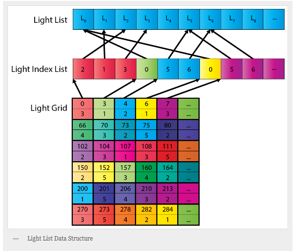
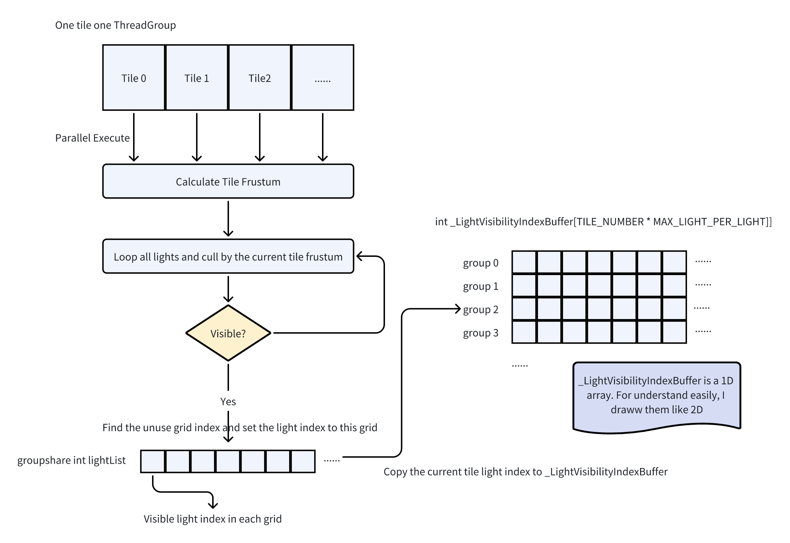

# Tile-Based Light Culling
{: .center}
## Introduction
The main idea of Tile-Based Shading (also known as Screen-space tile classification) group of algorithms is to divide the screen up into 2D tiles and determine how many and which light sources intersect each tile. Then calculate lighting only for visible light sources for each pixel in each tile.
There are 2 types of tile-based shading.
- Tile Based Deferred Shading
- Tile Based Forward Plus

Tile-Based Deferred Shading replaces the lighting stage of traditional Deferred Shading with light culling stage, where light sources are culled against screen space tile frusta.
Tile Based Forward Plus should call the light culling stage before the scene rendering. On the scene rendering pass, we could map the current pixel to the relative tile, and loop all the visible lights in the tile and add the reflectance of each light.
## Tile-based deferred shading
### GBuffer rendering
This step is similar to the traditional deferred shading.
### Divide the screen into tiles
The second step is to divide the screen into tiles. Each tile contains 16 x 16 pixels.
### Frustum calculation for each tile
Calculate the frustum of each tile by a compute shader. If your screen size is width and height, then the total thread number is:
Thread number x = screen width / tile size;
Thread number y = screen height / tile size;
Group number x = Thread number x / threadNumX;
Group number y = Thread number y / threadNumY;
### Light Culling
If the tile size is 16 x 16, and the number of lights is greater than 256(16x16), the number of working threads will be equal to the whole pixels of the screen. In this case, each thread has its own screen pixel coordinate, and we can sample the depth texture to get the min and max depth in each tile, for the purpose building the tile frustum.
After culling a visible light, we could calculate its lighting impact on the current pixel by sampling the GBuffer.
### Advantages of tile-based deferred shading
1. Constant and absolute minimal bandwidth. G-buffer data is read once per pixel. 
2. No need for intermediate light accumulation buffer 
3. Scales up to huge amount of big overlapping light sources
### Disadvantages of tile-based deferred shading
1. DirectX 11 hardware is required (Compute Shader 5.0).
2. Same problems with MSAA as in traditional deferred shading.
3. Not support multiple materials as in traditional deferred shading.
4. Same problems with transparent objects.

## Tile Based Forward Plus
Compared to the traditional forward rendering, Tile Based Forward Plus needs an extra compute shader pass to calculate the light culling per tile. And we should store the culling results to the light index buffer and light grid buffer. In the forward scene rendering pass, we could loop the lights stored in the relative tile data, accumulating all the light effects.

### Key point understanding
{: .center}

Look at the image above. The different colors of the Light Grid represent different tiles. The top number of a light grid represents the offset of the Light Index List. The bottom number represents the non-culled light number in this tile. Each Light Grid is executed by a thread group. The problem is that the second light grid has to know the non-culled light count of the previous light grid.

### Culling Operation
{: .center}

Rendering of tile-based lighting is very simple. We just need to find the relative tile of the current pixel, and travelling the light index visibility buffer, then calculate the reflectance of the light.
```c++
void TileBasedAdditionalLightingFragmentPBR(BRDFData brdfData, float3 positionWS, float3 normalWS, float3 viewDirWS, float2 screenPos, out half3 outColor)
{
    outColor = 0;
    uint2 tileId = screenPos * (_TileNumber - 1);
    uint  lightIndexOffset = (tileId.y * _TileNumber.x + tileId.x) * MAX_LIGHT_NUM_PER_TILE;
    int lightIndex = _LightVisibilityIndexBuffer[lightIndexOffset];
    for (int i = 0; i < MAX_LIGHT_NUM_PER_TILE && lightIndex >= 0; ++i)
    {
        Light light = GetAdditionalLight(lightIndex, positionWS);
        outColor += AdditionalLightingPhysicallyBased(brdfData, light, normalWS, viewDirWS);
        lightIndex = _LightVisibilityIndexBuffer[lightIndexOffset + i + 1];
    }
}
```

### Advantages of tile-based forward shading
1. Light management is decoupled from geometry. 
2. Transparent objects can be shaded the same way as opaque. 
3. No problems with multiple materials and lighting models.
### Disadvantages of tile-based forward shading
1. Each pixel may be shaded more than once.
2. Scales worse with increasing light overdraw than tiled deferred shading.

## Reference
https://www.digipen.edu/sites/default/files/public/docs/theses/denis-ishmukhametov-master-of-science-in-computer-science-thesis-efficient-tile-based-deferred-shading-pipeline.pdf

https://takahiroharada.files.wordpress.com/2015/04/forward_plus.pdf

https://www.cse.chalmers.se/~uffe/clustered_shading_preprint.pdf

https://ubm-twvideo01.s3.amazonaws.com/o1/vault/gdc2015/presentations/Thomas_Gareth_Advancements_in_Tile-Based.pdf?tdsourcetag=s_pctim_aiomsg

https://www.cnblogs.com/KillerAery/p/17139487.html

https://wickedengine.net/2018/01/10/optimizing-tile-based-light-culling/

https://github.com/bcrusco/Forward-Plus-Renderer

https://www.3dgep.com/forward-plus/

https://simoncoenen.com/blog/programming/graphics/SpotlightCulling

