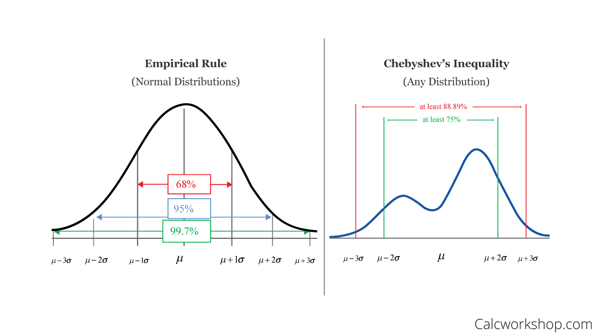
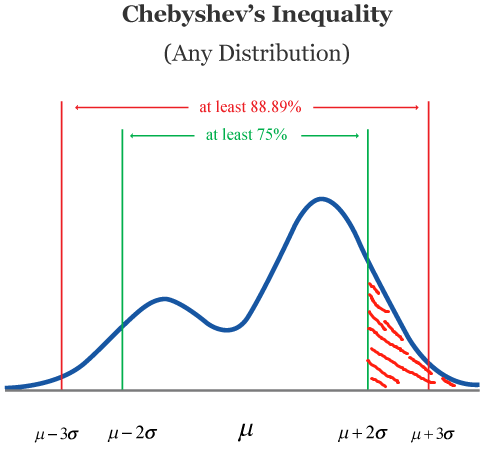
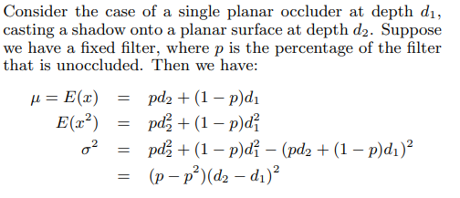
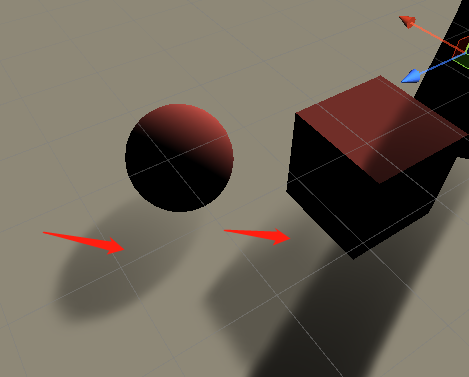

# Variance Shadow Mapping
## Algorithm Overview
### Understand Chebyshev's Inequality
Before going to the implementation, we need to understand the following formulas.
$\mu = E(x)= M_1$
$\sigma^2 = E(x^2) - E(x)^2 = M_2 - M_1$
$P(x \geq t) \leq p_{max}(t) \equiv \frac{\sigma^2}{\sigma^2 + (t - \mu)^2}$
First we should know what $x$ and $t$ represent.
I think $x$ represents the real depth shading point. And $t$ represents the depth of the shading point in the shadowmap.
And then what $p_{max}$ means? Let me explain the [Chebychev’s inequality](https://calcworkshop.com/joint-probability-distribution/chebyshev-inequality/) below because I don't want to just know how to use it but fully understand it.
See this picture(from [calcworkshop.com](https://calcworkshop.com/)).

In normal distribution, there is an empirical rule that we know the probability inside the multiple of standard derivation. As we see in the left picture, the empirical rule tells us about the probability of one standard derivation and two and three.
But what about other distributions? As Calcworkshop.com says, we use Chebyshev’s inequality because it can be to any data set and a wide range of probability distributions, not just normal or bell-shaped curves!
See the right picture above, it is the standard version of the Chebyshev’s inequality so it has two tail probability.
Return to the variance shadow mapping. We think of t as μ + any standard derivation σ. Because t is the actual depth of the light.
So the probability $P(x \geq \mu + 2\sigma)$ is so in this picture(the red region):

So the equation below represents the probability of not being in the shadow with the shading point.
$$P(X \geq t) = p_{max}(t) \equiv \frac{\sigma ^2}{\sigma ^2 + (t - \mu)^2}$$
For t is the depth of the shading point in shadow view. If X is greater than t, it is sure the shading point is not in the shadow.
If we use PCF to determine the probability p of a shading point, we know exactly what the p is.(Because it is calculated by the filter). Then we can use it to calculate the $E(x)$ from paper[2]:

Here comes a question. Why $E(x)$ is computed by the formula above? If we see $E(x)$ as the average depth, maybe we can imagine the equation well.
As the paper[3] mentions, if the depth of the shading point is less than the $E(x)$, it is definitely not in the shadow, otherwise the visibility function is computed by the Chbyshelve equation.
$P(x \geq t) \approx\begin{cases}
  1 \space \space \rm if \space t \leq \mu  \\
  \frac{\sigma^2}{\sigma^2 + (t-\mu)^2} \space \space \rm if \space t > \mu
\end{cases}$
What if $t >\mu$ or  $t \approx \mu$ ? As I have implemented in my project, we can see the result in the picture below.

This is caused by Chbyshelve's equation which calculates a value close to 1. 
We should give a minimum value of σ² to avoid this problem.
```C++
float variance = max(shadow.g - mean * mean, 0.0002);
float pMax = ChebyshevEquation(z, mean, variance);
return pMax;
```
After modified:

### Biasing
What shadow bias really is? We know that self shadow will cause shadow ance easily. But in variance shadow mapping, we don't need the depth bias since the shadow is not calculated by the depth compare. But we need to clamp the variance to a proper value. So in this case, __Bias__ means variance bias, not depth bias.
From GPU Gem3 chapter 8, a solution to the problem of shadow biasing is introduced. 
If we see the shadow map as a parametric surface, each pixel in shadow map has their tangent plane. As the paper said:

So f(x,y) is the depth plane equation for each pixel.
Then the second moment(the variance) can be computed by the following equation:

## Light Bleeding